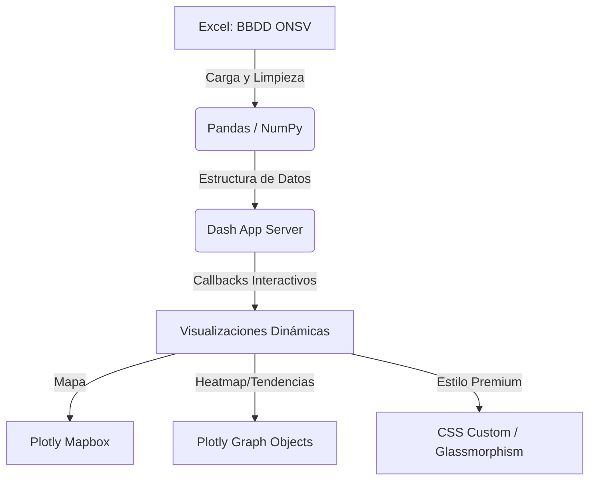

# Dashboard de Monitoreo de Seguridad Vial (ONSV 2021-2023)
**Curso:** Estadística Espacial  
**Proyecto:** Plataforma Inteligente de Siniestros Fatales y Análisis de Vías  

---

## 📌 1. Introducción y Contexto del Proyecto

### El Problema de la Seguridad Vial
Los accidentes de tránsito representan una de las principales causas de muerte violenta y discapacidad a nivel global y nacional. Tradicionalmente, la seguridad vial se ha analizado mediante estadísticas agregadas (tablas de frecuencias, promedios anuales). Sin embargo, **los accidentes ocurren en un lugar y momento específico**, lo que hace que el **análisis espacial y espaciotemporal** sea indispensable para diseñar políticas de mitigación efectivas.

### Objetivos del Dashboard
1. **Georreferenciar** con alta precisión los siniestros viales fatales en Perú.
2. **Identificar "puntos calientes" (hotspots)** de alta concentración y severidad de siniestros.
3. **Analizar la interacción espaciotemporal** de los accidentes (días y horas de mayor riesgo).
4. **Evaluar el impacto de la infraestructura** vial (carreteras vs. vías urbanas) en la letalidad.

---

## 📊 2. Ficha Técnica de los Datos

| Atributo | Detalle Técnico |
| :--- | :--- |
| **Fuente de Datos** | Observatorio Nacional de Seguridad Vial (ONSV) - Ministerio de Transportes y Comunicaciones (MTC) del Perú. |
| **Periodo Temporal** | Años 2021, 2022 y 2023. |
| **Volumen Inicial** | Base de datos cargada desde `BBDD ONSV - SINIESTROS 2021-2023.xlsx` (Hoja: `SINIESTROS`). |
| **Tratamiento Espacial** | Filtrado estricto por límites geográficos peruanos (*Bounding Box*): • Latitud: $[-19.0, -3.0]$ • Longitud: $[-82.0, -68.0]$ |
| **Limpieza de Coordenadas** | Eliminación de registros con valores de coordenada nulos (`NaN`) o fuera del rango geográfico nacional. |

---

## 🛠️ 3. Arquitectura y Stack Tecnológico

El dashboard fue desarrollado enteramente en **Python**, implementando una arquitectura interactiva y de alto rendimiento:

* **Procesamiento de Datos:** `pandas` y `numpy` para limpieza, conversión de tipos de datos, normalización de strings y agrupaciones espaciotemporales.
* **Framework Web:** `Dash` (by Plotly) para la estructura de la aplicación y la interactividad reactiva en tiempo real mediante *callbacks*.
* **Motor de Gráficos:** `plotly.express` y `plotly.graph_objects` para la renderización de mapas y gráficos analíticos.
* **Interfaz de Usuario (UI/UX):** Inspirado en sistemas industriales de alta gama, implementa un diseño *Glassmorphic* oscuro (`rgba(17, 22, 34, 0.7)` con desenfoque de fondo *backdrop-filter*), tipografía moderna (`Segoe UI`) y paleta de colores neón de alta fidelidad:
  * 🩵 **Cian (`#38bdf8`):** Siniestros generales y controles.
  * 🧡 **Coral/Naranja (`#ff7a45`):** Fallecidos y zonas críticas de máximo riesgo.
  * 💚 **Esmeralda (`#059669`):** Lesionados y estado de conexión estable.
  * 💛 **Ámbar (`#d97706`):** Letalidad e infraestructura.
  * 💜 **Púrpura (`#c084fc`):** Carreteras y alertas extremas.

---

## 🗺️ 4. Enfoque en Estadística Espacial y Cartografía

Esta sección es crucial para sustentar el enfoque académico de la exposición:

### A. Tipo de Objeto Espacial: Patrón de Puntos (Point Pattern)
En el análisis espacial, los siniestros viales se clasifican como **datos de patrón de puntos**. Cada fila de la base de datos representa un **evento discreto** que ocurre en una localización única y exacta del plano terrestre:
$$s_i = (x_i, y_i) \quad \text{donde } x \text{ es Longitud y } y \text{ es Latitud}$$

### B. Diseño del Mapa de Símbolos Proporcionales y Categorizados
El mapa interactivo se crea mediante la función `px.scatter_mapbox()` y se define de la siguiente manera:
1. **Geolocalización:** Mapeo directo de `lat` y `lon`.
2. **Escalamiento Proporcional (Atributo Tamaño):** El parámetro `size="fallecidos"` ajusta el diámetro de los marcadores (con un límite `size_max=32`). Esto permite identificar visualmente la **gravedad espacial** del siniestro.
3. **Mapeo Corocromático (Atributo Color):** El parámetro `color="clase"` diferencia el tipo de siniestro (choque, despiste, atropello, etc.). Ayuda a identificar patrones espaciales de comportamiento (ej. los despistes son comunes en curvas de carreteras de la sierra, mientras que los atropellos se concentran en zonas urbanas densas).
4. **Base Cartográfica:** Se utiliza el estilo `"carto-darkmatter"`. Este fondo oscuro tiene una justificación cartográfica clara: **minimiza el ruido cromático del relieve físico** y permite resaltar los puntos brillantes (neón) según la densidad y tipo de evento.

---

## 📊 5. Componentes y Paneles del Dashboard

Durante la demostración del dashboard, se deben explicar los siguientes paneles:

### 1. Panel de Control y Filtros Dinámicos (Columna Izquierda)
Permite al usuario realizar un filtrado multidimensional interactivo. Al cambiar un filtro, todos los gráficos y KPIs se recalculan automáticamente en el servidor:
* **Filtro de Regiones (Departamentos):** Filtra espacialmente por uno o más departamentos del Perú.
* **Filtro de Período (Año):** Selección temporal de los años 2021, 2022 o 2023.
* **Filtro de Infraestructura (Tipo de Vía):** Separa el análisis por Carreteras, Calles, Avenidas, etc.
* **Filtro de Clase de Siniestro:** Limita el gráfico al tipo específico de accidente.

### 2. Tarjetas de Indicadores Clave (KPIs Superiores)
* **Siniestros Fatales:** Total de accidentes que reportaron al menos una víctima mortal.
* **Total Fallecidos:** Sumatoria total del saldo de muertes.
* **Total Lesionados:** Sumatoria de las personas heridas.
* **Índice de Letalidad:** Promedio de muertes por siniestro ($\text{Letalidad} = \frac{\text{Total Fallecidos}}{\text{Total Siniestros}}$).
* **Zonas de Carretera:** Porcentaje de siniestros ocurridos específicamente en carreteras (vías de alta velocidad).

### 3. Regiones Críticas - Top 5 (Columna Izquierda - Abajo)
Muestra los 5 departamentos con mayor cantidad de siniestros y fallecidos. Incorpora una **barra de progreso neón** proporcional y un badge dinámico de nivel de riesgo:
* 🚨 **Riesgo Crítico:** $> 400$ fallecidos.
* ⚠️ **Riesgo Alto:** $> 150$ fallecidos.
* 🟢 **Riesgo Moderado:** $\le 150$ fallecidos.

### 4. Gráficos de Tendencias Temporales e Infraestructura (Centro - Abajo)
* **Evolución Mensual (Línea de Tendencia):** Grafica dos series temporales superpuestas (Siniestros vs. Víctimas Mortales) para identificar estacionalidades y variaciones de tendencia interanual.
* **Letalidad por Infraestructura (Eje Y Dual):** Compara el volumen de siniestros (barras en cian) contra el promedio de fallecidos por accidente (línea ámbar). Permite demostrar que, aunque en las calles urbanas hay muchos siniestros, **las carreteras tienen un índice de letalidad significativamente más alto** debido a la velocidad de operación.

### 5. Matriz de Riesgo Temporal (Columna Derecha - Heatmap)
Grafica los siniestros cruzando dos ejes temporales: las **24 horas del día** (eje Y) y los **7 días de la semana** (eje X).
* **Propósito en Estadística Espacial:** Representa el comportamiento de las dinámicas humanas sobre el espacio. Permite identificar de manera inmediata si los picos ocurren en horas de salida escolar/laboral, o en horas de la madrugada durante los fines de semana (asociados a fatiga o consumo de alcohol).

### 6. Alertas de Accidentes Críticos (Columna Derecha - Arriba)
Lista en orden cronológico los siniestros más graves que involucran $\ge 4$ fallecidos. Asigna etiquetas de prioridad según la gravedad extrema:
* 🔴 **CRÍTICO:** $\ge 10$ fallecidos en un solo accidente.
* 🟡 **EXTREMO:** Entre $4$ y $9$ fallecidos.

---

## 🗣️ 6. Guion Sugerido para la Exposición (Paso a Paso)

### Introducción (Minuto 0 a 2)
> *"Buenos días, profesor y compañeros. Hoy presentaremos nuestro Dashboard de Monitoreo de Seguridad Vial, enfocado en el análisis de siniestros fatales en el Perú durante el periodo 2021-2023. Desde la perspectiva de la estadística espacial, los siniestros viales no son eventos aleatorios homogéneos en el territorio; se comportan como patrones de puntos condicionados por factores geográficos, temporales y de infraestructura."*

### Los Datos y Limpieza Espacial (Minuto 2 a 4)
> *"Nuestra base de datos fue obtenida del Observatorio Nacional de Seguridad Vial. Para el análisis espacial, realizamos un filtro riguroso en Python, eliminando registros incompletos y restringiendo los puntos al marco geográfico de Perú mediante una caja delimitadora de coordenadas de latitud y longitud. Esto nos asegura que no existan puntos erróneos proyectados en el océano o fuera de las fronteras."*

### Demostración del Mapa e Interpretación Espacial (Minuto 4 a 7)
> *"El corazón del dashboard es el mapa geoespacial central. Aquí representamos cada siniestro como un objeto puntual. Hemos aplicado una cartografía de símbolos proporcionales: el tamaño de cada punto se escala en base al número de fallecidos, permitiendo ver a simple vista los accidentes más catastróficos. Adicionalmente, el color representa la clase del siniestro. Si filtramos solo por 'Carreteras', notaremos un patrón espacial lineal a lo largo de la Carretera Panamericana y la Carretera Central, dominado por colores que representan 'Despistes' y 'Choques'. En contraste, al filtrar por áreas urbanas, los puntos se aglomeran en clústeres densos y el color cambia predominantemente a 'Atropellos'."*

### Dinámicas Temporales e Infraestructura (Minuto 7 a 9)
> *"Para complementar el análisis espacial, el dashboard integra dinámicas temporales. En la matriz de riesgo o Heatmap a la derecha, observamos claramente cómo los siniestros se concentran en franjas horarias específicas, especialmente durante los fines de semana en la madrugada, lo cual sugiere factores de riesgo asociados a la conducción nocturna o cansancio. Finalmente, en el gráfico de infraestructura, demostramos una hipótesis clave: aunque las zonas urbanas acumulan un alto volumen de accidentes, el índice de letalidad promedio (línea dorada) es sustancialmente mayor en las carreteras debido a las velocidades de diseño, superando el promedio de muertes por siniestro de la red urbana."*

### Conclusiones (Minuto 9 a 10)
> *"En conclusión, este dashboard demuestra que la estadística espacial, combinada con herramientas modernas de ciencia de datos, permite pasar de un reporte numérico plano a una herramienta visual interactiva de diagnóstico territorial. Esto facilita a las autoridades la identificación de puntos negros o tramos de concentración de accidentes para priorizar intervenciones en infraestructura vial. Quedamos atentos a sus preguntas."*
