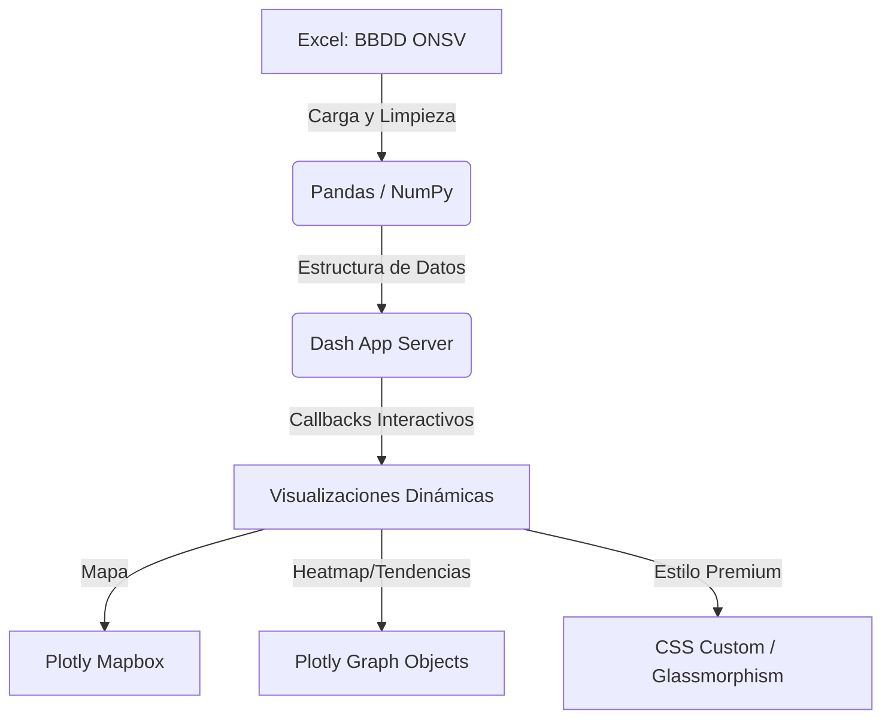

# Dashboard de Monitoreo de Seguridad Vial (ONSV 2021-2023)
**Curso:** Estadística Espacial  
**Proyecto:** Plataforma Inteligente de Siniestros Fatales y Análisis de Vías  

---

## 📌 1. Introducción y Contexto del Proyecto

### El Problema de la Seguridad Vial
Los accidentes de tránsito representan una de las principales causas de muerte violenta y discapacidad a nivel global y nacional. Tradicionalmente, la seguridad vial se ha analizado mediante estadísticas agregadas (tablas de frecuencias, promedios anuales). Sin embargo, **los accidentes ocurren en un lugar y momento específico**, lo que hace que el **análisis espacial y espaciotemporal** sea indispensable para diseñar políticas de mitigación efectivas.

### Objetivos del Dashboard
1. **Georreferenciar** con alta precisión los siniestros viales fatales en Perú.
2. **Identificar "puntos calientes" (hotspots)** de alta concentración y severidad de siniestros.
3. **Analizar la interacción espaciotemporal** de los accidentes (días y horas de mayor riesgo).
4. **Evaluar el impacto de la infraestructura** vial (carreteras vs. vías urbanas) en la letalidad.

---

## 📊 2. Ficha Técnica de los Datos

| Atributo | Detalle Técnico |
| :--- | :--- |
| **Fuente de Datos** | Observatorio Nacional de Seguridad Vial (ONSV) - Ministerio de Transportes y Comunicaciones (MTC) del Perú. |
| **Periodo Temporal** | Años 2021, 2022 y 2023. |
| **Volumen Inicial** | Base de datos cargada desde `BBDD ONSV - SINIESTROS 2021-2023.xlsx` (Hoja: `SINIESTROS`). |
| **Tratamiento Espacial** | Filtrado estricto por límites geográficos peruanos (*Bounding Box*):<br>• Latitud: $[-19.0, -3.0]$<br>• Longitud: $[-82.0, -68.0]$ |
| **Limpieza de Coordenadas** | Eliminación de registros con valores de coordenada nulos (`NaN`) o fuera del rango geográfico nacional. |

---

## 🛠️ 3. Arquitectura y Stack Tecnológico

El dashboard fue desarrollado enteramente en **Python**, implementando una arquitectura interactiva y de alto rendimiento:



* **Procesamiento de Datos:** `pandas` y `numpy` para limpieza, conversión de tipos de datos, normalización de strings y agrupaciones espaciotemporales.
* **Framework Web:** `Dash` (by Plotly) para la estructura de la aplicación y la interactividad reactiva en tiempo real mediante *callbacks*.
* **Motor de Gráficos:** `plotly.express` y `plotly.graph_objects` para la renderización de mapas y gráficos analíticos.
* **Interfaz de Usuario (UI/UX):** Estilo *Glassmorphic* oscuro (`rgba(17, 22, 34, 0.7)` con desenfoque de fondo), tipografía moderna (`Segoe UI`) y paleta de colores neón de alta fidelidad:
  * 🩵 **Cian (`#38bdf8`):** Siniestros generales y controles.
  * 🧡 **Coral/Naranja (`#ff7a45`):** Fallecidos y zonas críticas de máximo riesgo.
  * 💚 **Esmeralda (`#059669`):** Lesionados y estado de conexión estable.
  * 💛 **Ámbar (`#d97706`):** Letalidad e infraestructura.
  * 💜 **Púrpura (`#c084fc`):** Carreteras y alertas extremas.

---

## 🗺️ 4. Enfoque en Estadística Espacial y Cartografía

### A. Tipo de Objeto Espacial: Patrón de Puntos (Point Pattern)
En el análisis espacial, los siniestros viales se clasifican como **datos de patrón de puntos**. Cada fila de la base de datos representa un **evento discreto** que ocurre en una localización única y exacta del plano terrestre:
$$s_i = (x_i, y_i) \quad \text{donde } x \text{ es Longitud y } y \text{ es Latitud}$$

### B. Diseño del Mapa de Símbolos Proporcionales y Categorizados
El mapa interactivo se crea mediante la función `px.scatter_mapbox()` y se define de la siguiente manera:
1. **Geolocalización:** Mapeo directo de `lat` y `lon`.
2. **Escalamiento Proporcional (Atributo Tamaño):** El parámetro `size="fallecidos"` ajusta el diámetro de los marcadores (con un límite `size_max=32`). Esto permite identificar visualmente la **gravedad espacial** del siniestro.
3. **Mapeo Corocromático (Atributo Color):** El parámetro `color="clase"` diferencia el tipo de siniestro (choque, despiste, atropello, etc.).
4. **Base Cartográfica:** Se utiliza el estilo `"carto-darkmatter"`. Este fondo oscuro **minimiza el ruido cromático del relieve físico** y resalta los puntos brillantes según la densidad y tipo de evento.

---

## 🖥️ 5. Estructura de Código y Funciones de la Aplicación

El archivo principal [dashboard_siniestros.py](file:///d:/EstEspacial/EstEspacial/dashboard_siniestros.py) está estructurado en secciones modulares:

### A. Variables y Paleta de Colores
En la sección `2. CONSTANTES DE DISEÑO PREMIUM`, se centraliza la paleta de colores cromática de la aplicación (que ahora también consume el archivo externo [styles.css](file:///d:/EstEspacial/EstEspacial/assets/styles.css) mediante variables CSS):
* `DARK_BG = "#080b11"`: Fondo oscuro principal.
* `TEXT_COLOR = "#f1f5f9"`: Texto claro brillante.
* `LABEL_COLOR = "#94a3b8"`: Gris suave para etiquetas.
* `CYAN_ACCENT = "#38bdf8"`, `CORAL_ACCENT = "#ff7a45"`, `EMERALD_ACCENT = "#059669"`, `AMBER_ACCENT = "#d97706"`, `PURPLE_ACCENT = "#c084fc"`.
* `CLASE_COLORS`: Diccionario que mapea cada tipo de siniestro (`CHOQUE`, `DESPISTE`, `ATROPELLO`, etc.) a su color de resplandor correspondiente en el mapa.

### B. Funciones Auxiliares
1. **`extract_hour(x)`**:
   * **Propósito:** Procesa la columna de horas del archivo Excel.
   * **Funcionamiento:** Convierte el valor de celda a texto. Si contiene `:` (formato HH:MM), divide la cadena y extrae la hora entera; si es un número decimal o float, lo convierte de forma segura; si falla (por nulos o caracteres especiales), retorna `12` (mediodía) por defecto.
2. **`create_kpi_card(title, value_id, sub_id, icon, glow_color)`**:
   * **Propósito:** Generador dinámico de componentes HTML para las tarjetas de KPIs.
   * **Funcionamiento:** Crea un contenedor (`html.Div`) con la clase CSS `.card-kpi` y le inyecta estilos inline personalizados (como un borde izquierdo del color del indicador `glow_color` y una sombra difuminada leve `glow_color` + `"0d"` para el resplandor).
3. **`_make_chips(selected, all_vals)`**:
   * **Propósito:** Renderiza dinámicamente las etiquetas o "chips" dentro de la barra de filtros principal.
   * **Funcionamiento:** Si no hay nada seleccionado, retorna una etiqueta de "Todos (sin filtro)". Si está todo seleccionado, retorna "Todos (N)". En selecciones parciales, muestra los primeros `MAX_VIS = 2` nombres como chips individuales y añade un contador tipo "+N Seleccionados" para optimizar el espacio visual.

### C. Lógica de Filtrado de Datos
* **`filter_data(depts, years, vias, clases)`**:
   * **Propósito:** Filtra el DataFrame original en base a la selección activa del usuario.
   * **Funcionamiento:** Inicializa una máscara booleana (`pd.Series`) en `True` para todas las filas. Aplica la operación `mask &= df['columna'].isin(valores)` para cada filtro no vacío. Al final, retorna el DataFrame filtrado `df[mask]`. Si un filtro está vacío (lista vacía), **no aplica restricción** en esa dimensión, asumiendo que el usuario desea ver todos los datos.

### D. Callbacks de Sincronización e Interacción
1. **Sincronización de Checklists y Dropdowns Ocultos:**
   * Las funciones `sync_filter_depts`, `sync_filter_years`, `sync_filter_vias` y `sync_filter_clases` sincronizan las interacciones de los checklists interactivos con componentes ocultos que centralizan los estados para simplificar las llamadas cruzadas de Dash.
2. **Interacciones en Filtros (Select All / None / Clear):**
   * Funciones como `ctrl_depts`, `ctrl_years`, etc., leen cuál botón (`Todo`, `Ninguno`, `Limpiar`) fue activado mediante la propiedad `dash.ctx.triggered_id` y retornan el arreglo completo de opciones o un arreglo vacío `[]` para resetear el checklist en un solo clic.
3. **Búsqueda en Tiempo Real (Clientside Callbacks):**
   * Definido mediante `app.clientside_callback()`. Ejecuta la función nativa de JavaScript `_SEARCH_JS` **directamente en el navegador** del cliente. Esto filtra la propiedad `options` del checklist mientras el usuario escribe en el input de búsqueda, eliminando la latencia del viaje de ida y vuelta al servidor Python.

### E. Lógica Central del Dashboard (`run_dashboard_logic`)
Esta función procesa el DataFrame filtrado `dff` y genera todas las métricas y figuras:
1. **Cálculo de KPIs:** Extrae el total de filas, la suma de las columnas `fallecidos` y `lesionados`, calcula la letalidad promedio y la proporción de siniestros fatales en carreteras.
2. **Lista de Regiones Críticas (Top 5):** Agrupa `dff` por `departamento`, cuenta siniestros, suma muertes, selecciona las 5 regiones principales y renderiza las barras de progreso con badges dinámicos según el volumen de fallecidos.
3. **Mapa Geoespacial:**
   * **Mapeo de Datos:** Aplica el mapa de colores.
   * **Control de Vacíos (Empty Handling):** Si el DataFrame filtrado está vacío, genera un objeto `go.Figure(go.Scattermapbox(lat=[], lon=[]))` con estilo `"carto-darkmatter"` fijado y centrado en el Perú, evitando que la interfaz falle y muestre un lienzo cartesiano blanco.
4. **Gráfico de Tendencia Mensual:** Agrupa datos por año y mes para graficar las dos series de tiempo.
5. **Gráficos de Infraestructura:** Agrupa datos por `tipo_via` y compara el total de siniestros vs la tasa de letalidad media utilizando un eje doble y.
6. **Matriz de Calor (Heatmap):** Pivota la cantidad de siniestros sobre una cuadrícula de 24 horas y 7 días de la semana, configurando una escala de colores neón degradada desde cian hasta coral.

---

## 🔍 6. Guía de Consultas Avanzadas con Pandas (Consola y Scripts)

Para realizar análisis exploratorios rápidos en la consola de Python o crear scripts estadísticos adicionales, puedes consultar la base de datos cargando el archivo Excel con `pandas`. A continuación, se detallan las consultas clave:

### 1. Carga e Inicialización Segura
```python
import pandas as pd

# Cargar el dataset
df = pd.read_excel("BBDD ONSV - SINIESTROS 2021-2023.xlsx", sheet_name="SINIESTROS")

# Renombrar columnas clave para facilitar la sintaxis
df.rename(columns={
    'CANTIDAD DE FALLECIDOS': 'fallecidos',
    'CANTIDAD DE LESIONADOS': 'lesionados',
    'DEPARTAMENTO': 'departamento',
    'TIPO DE VÍA': 'tipo_via',
    'CLASE SINIESTRO': 'clase',
    'FECHA SINIESTRO': 'fecha',
    'COD CARRETERA': 'cod_carretera'
}, inplace=True)
```

### 2. Consultas y Filtrados Comunes

* **Filtrar siniestros fatales extremados (donde fallecieron 5 o más personas):**
  ```python
  siniestros_criticos = df[df['fallecidos'] >= 5]
  print(siniestros_criticos[['fecha', 'departamento', 'fallecidos', 'clase']])
  ```

* **Filtrar por múltiples condiciones (Siniestros en LIMA, durante el año 2023, en CARRETERAS):**
  ```python
  # Asegurar parseo de fechas para extraer el año
  df['year'] = pd.to_datetime(df['fecha'], format='%d/%m/%Y', errors='coerce').dt.year
  
  query_dff = df[
      (df['departamento'].str.upper() == 'LIMA') & 
      (df['year'] == 2023) & 
      (df['tipo_via'].str.upper() == 'CARRETERA')
  ]
  print(f"Total registros encontrados: {len(query_dff)}")
  ```

### 3. Agrupaciones y Estadísticas Descriptivas

* **Obtener el Top 5 de departamentos con mayor número de fallecidos acumulados:**
  ```python
  top_fallecidos = df.groupby('departamento')['fallecidos'].sum().reset_index()
  top_fallecidos = top_fallecidos.sort_values(by='fallecidos', ascending=False)
  print(top_fallecidos.head(5))
  ```

* **Calcular la tasa de letalidad promedio por Tipo de Vía:**
  *La tasa de letalidad representa la cantidad de muertes promedio por accidente.*
  ```python
  letalidad_via = df.groupby('tipo_via').agg(
      total_siniestros=('fallecidos', 'count'),
      total_fallecidos=('fallecidos', 'sum'),
      tasa_letalidad=('fallecidos', 'mean')
  ).reset_index().sort_values(by='tasa_letalidad', ascending=False)
  print(letalidad_via)
  ```

* **Distribución de accidentes por Hora del Día (Picos de Tráfico):**
  ```python
  # Extraer la hora numérica de la columna 'HORA SINIESTRO' (asumiendo que contiene HH:MM o enteros)
  df['hora_num'] = pd.to_numeric(df['hora'], errors='coerce') # si ya está normalizada en el dashboard
  
  accidentes_por_hora = df['hora_num'].value_counts().sort_index()
  print("Distribución de siniestros por hora:")
  print(accidentes_por_hora)
  ```

### 4. Consultas Espaciales y Coordenadas

* **Buscar coordenadas extremas de accidentes fatales (Puntos geográficos críticos):**
  ```python
  # Limpiar coordenadas nulas
  df_coord = df.dropna(subset=['lat', 'lon']) # asumiendo nombres normalizados
  
  # Accidentes en carreteras con más de 3 fallecidos
  acc_carreteras_fatales = df_coord[
      (df_coord['tipo_via'].str.upper() == 'CARRETERA') & 
      (df_coord['fallecidos'] >= 3)
  ]
  print(acc_carreteras_fatales[['lat', 'lon', 'departamento', 'cod_carretera', 'fallecidos']])
  ```
